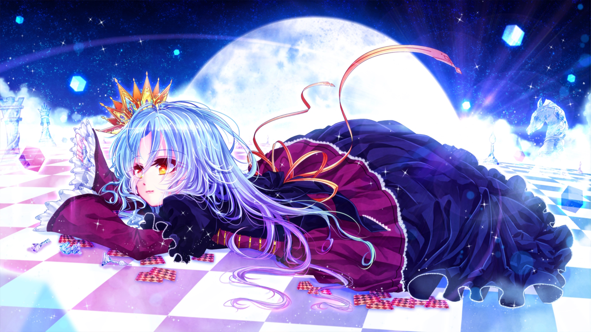

# No Game No Life

The picture is a fan-made picture of Shiro from `No Game No Life`. Honestly, I love this picture because of the colors used and how well done Shiro is drawn.

As to why I love it, I guess it's better to quote **Horace**.

---

> “A picture is a poem without words”

---

Let's say that you've heard a poem that really moves your heart, it's the same for me with this picture. A picture says a thousand words, yet this one speaks over a thousand for me.
Well, I won't go into details since it'll become a far longer post than I want. Anyway, Just look at the picture and build your own understanding of what is so captivating about it.
