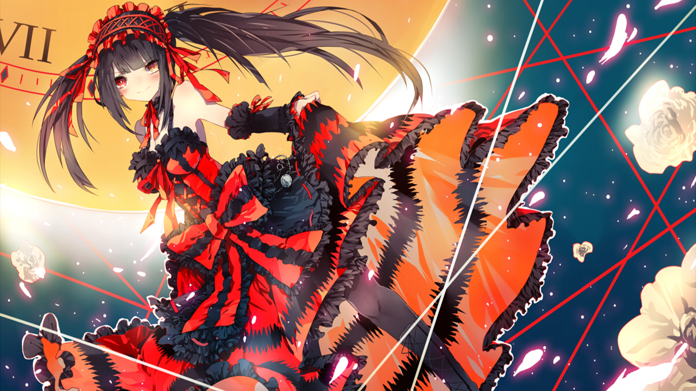

# Kurumi

Kurumi appears in `Date A Live`, and is somewhat of an antagonist of the series. Though she appears as an antagonist, she helps the main character at certain points, and her character gets more developed as we get deeper into the story.

---

> "You were ready to kill another creature, yet you're scared to be killed. Don't you think that's weird? When you point a gun at another life... This is what happens"

---

If you want to know more about her, then I suggest checking her [wikia page](https://date-a-live.fandom.com/wiki/Kurumi_Tokisaki). Though I suggest watching `Date A Live` instead of just reading the wikia about her, since you'll get a better view by either watching the anime or reading the light novels about `Date A Live`.

